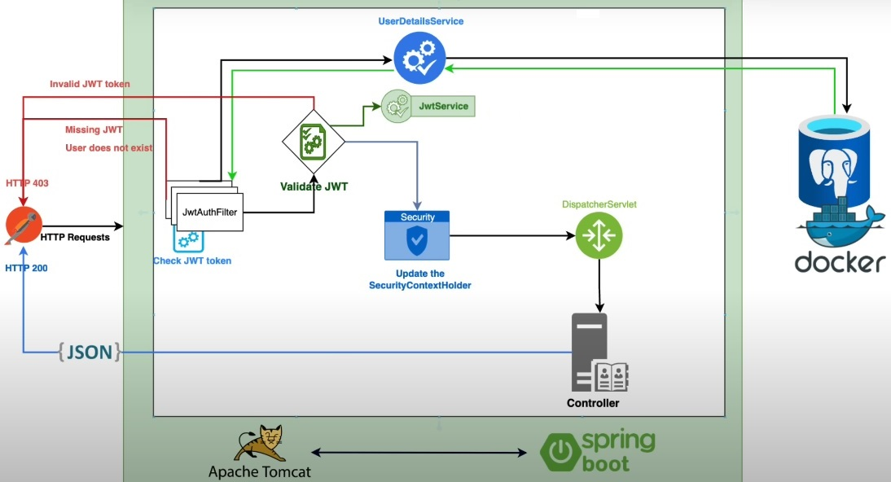
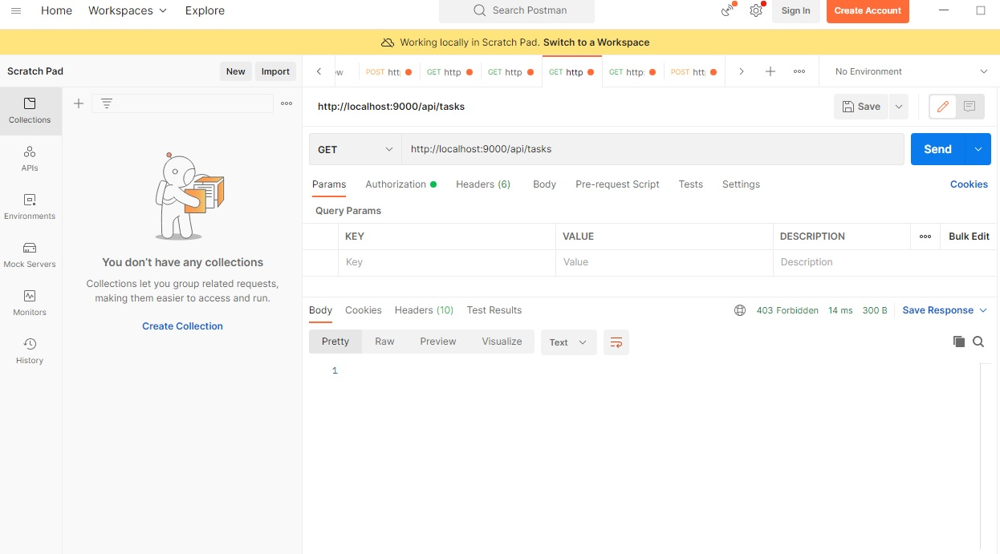
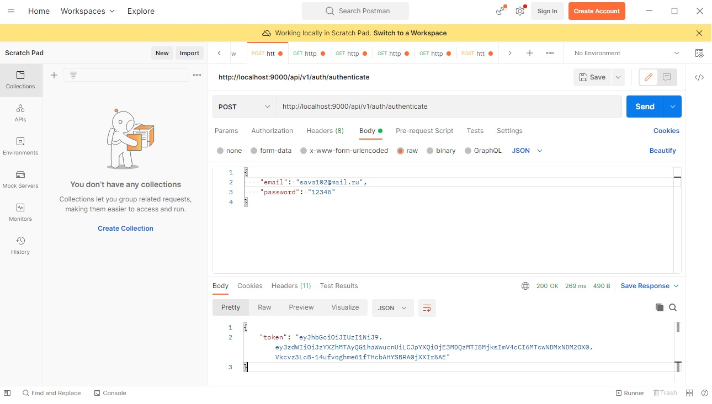
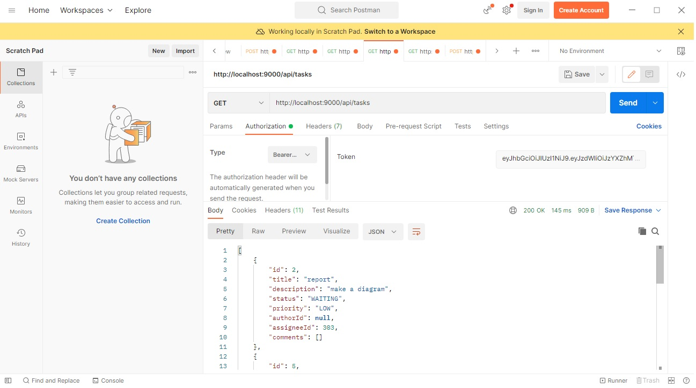

# Task Management System

## Описание проекта

Разработано приложение - REST-сервис. Сервис предоставляет REST интерфейс для возможности обеспечивать создание, редактирование, удаление и просмотр задач. 
Все запросы к сервису авторизованы и доступен на порту 9000.

## Описании реализации:

- Приложение разработано с использованием Spring Boot
- Использован сборщик пакетов maven
- Использована база данных postgresql
- Использована валидация данных
- Для запуска используется docker, docker-compose
- Код размещен на github
- Код покрыт unit тестами с использованием mockito 
- Информация о пользователях сервиса, задачах, комментариях хранится в базе данных
- Сервис задокументирован и описан с помощью Open API и Swagger.

## Описание и запуск сервиса:

1. Скачать данный проект, с помощью команды git clone.
2. Открыть проект с помощью IntelliJ IDEA. 
3. В терминале выполнить команду ./mvnw clean package (создаться jar файл в папке target)
4. Перейти в директорию проекта и с помощью docker запусть docker-compose.yml командой (docker-compose up). После запуска создадутся все необходимые в базе данных таблицы.
5. Изначально все тесты закомментированы чтобы получить jar файл.
6. После запуска и сборки docker контейнера требуется раскомментировать данные тесты и запустить.

## Сервис аутентифицироват с помощью JWT токена. Наглядная схема:

После запуска и сборки docker контейнера проверить работу сервиса можно с помощью Postman.
Сервис также задокументирован и описан с помощью Open API и Swagger.
Доступен по адресу http://localhost:9000/swagger-ui/index.html

## Пример аутенфикации пользователя с помощью Postman:
(предполагается что в базе данных уже содержатся пользователи, созданные задачи).
Пробуем получить список задач.

Получаем ошибку 403. У нас нет доступа.
Делаем авторизацию отправляя POST запрос (в теле запроса email и password) и получаем токен 

После этого берем токен и вcтавляем его на вкладке Authorization, выбрав тип "Bearer token".

Получаем список задач.(ответ сервера 200)

Остальные методы контроллеров, все доступные можно протестировать с помощью Swagger.
(по адресу http://localhost:9000/swagger-ui/index.html)
Сервис получился не идеальный, конечно можно добавлять еще методы, контроллеры. При регистрации   
пользователя применил валидацию email, password и username. 
Можно также добавить миграциями liquibase, усовершенствовать под контретные задачи.

